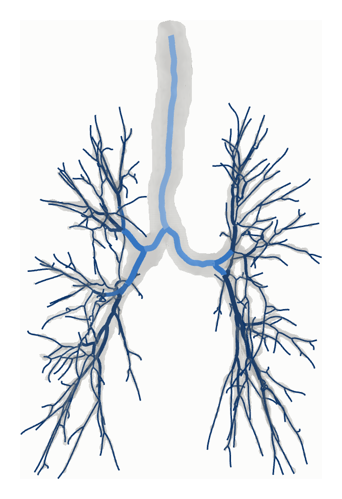
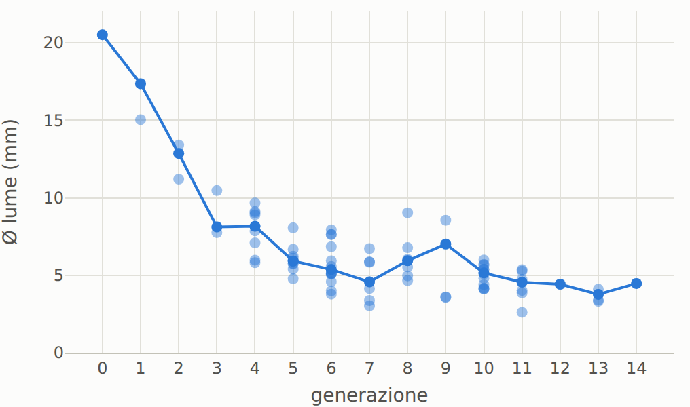
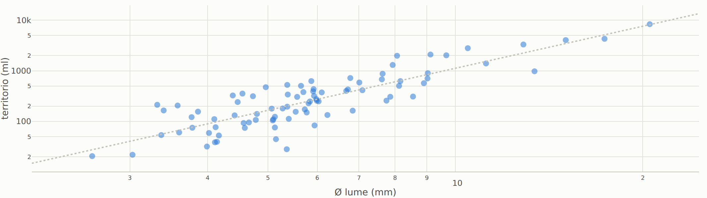
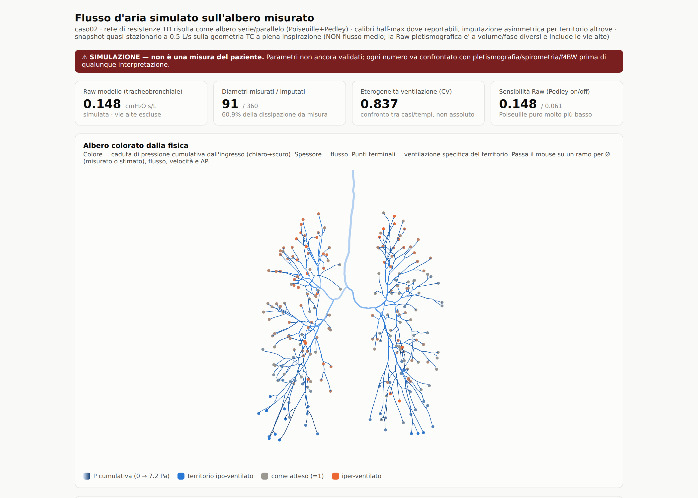

# AirwayLab

[](https://doi.org/10.5281/zenodo.21963989)

**Transparent quantitative CT analysis of the airways.**

AirwayLab segments the bronchial tree and the pulmonary vessels from a chest CT,
measures lumen caliber and wall thickness on centerline-perpendicular sections,
maps how much parenchyma each branch serves, detects mucus-plug candidates, and
writes everything into a single interactive HTML report that opens in any
browser — no server, no license, no black box.

> **Research software.** AirwayLab is not a medical device and must not be used
> for clinical decision-making.

The whole analysis lands in one self-contained HTML report. A few of its
derived views (anonymized example case):

**Airway tree** — the segmented bronchial tree; the caliber-reportable core is
highlighted, the deep tree kept for topology and territories is shown darker.



**Caliber by generation** and **territory vs caliber** (Murray-law fit) — every
per-branch value is measured on centerline-perpendicular sections.





**Exploratory 1D air-flow model** — a resistance network solved on the measured
tree, colored by cumulative pressure with per-territory ventilation; a
standalone simulation, clearly marked as such, never a clinical measurement.



## Why another airway tool?

Commercial platforms are validated and powerful, but they are closed: you get a
number, not the evidence for it. AirwayLab is built around one principle —
**every number ships with its image** (precisely: every per-branch caliber and
wall value links to its measured sections — counts of attempted/accepted
sections are reported — and each branch shows a verification section with the
lumen boundary in blue and the outer wall boundary in orange, drawn only in
sectors where the wall borders aerated parenchyma; aggregate indices are
computed from these audited per-branch values). Automatic QC classifies every branch (`ok` / `stump` / `oblique` /
`no-wall` / `unstable`), the reader can exclude any branch with one click, and
the exclusion list is exportable as part of the study audit trail.

## What it measures

| Domain | Outputs | Status |
|---|---|---|
| Airway tree | segmentation (adaptive explosion-controlled region growing, or external/DL mask via `--mask` with air witness + resolution gates), skeleton, sub-voxel refined centerline, branch graph, generations, best-effort anatomical labels (lobar, B1–B10) | core |
| Lumen caliber | half-max radial boundary on ALL core sections (~1 mm spacing), area-equivalent diameter, per-branch QC with attempted/accepted section counts | core |
| Wall thickness | sector-wise FWHM with a positive parenchyma requirement; % valid sectors and % sectors above the physiological cap reported (the cap flags, it does not censor). WA% = 100·((d/2+w)²−(d/2)²)/(d/2+w)², defined only when wall is measurable | core |
| Longitudinal profiles | caliber and wall every 1 mm along every branch; straightened CPR panels with synchronized image + curves | core |
| Lungs | volume, mean lung density, LAA-950, Perc15 | core |
| Airway-to-lung ratio | multi-airway index + ALR4 (per Shimada et al., *J Appl Physiol* 2025) | exploratory |
| Territories | parenchyma partition per terminal branch (Euclidean), per-branch served volume, caliber–territory scaling exponent | exploratory |
| Vessels | vascular segmentation, TBV, BV5/BV10, vascular graph, bronchus-artery pairing (BA ratio), airway-vascular mismatch map | exploratory |
| Mucus plugs | propose-and-confirm candidates with vascular witness and downstream territory | exploratory |

*Core* endpoints are the candidates for metrological validation (phantom +
reader studies, in progress); *exploratory* indices are research hypotheses and
must not be interpreted as validated measurements. See
[`docs/REVIEW_BACKLOG.md`](docs/REVIEW_BACKLOG.md) for the open validation
program.

## Install

```bash
pip install -e .
```

Requires Python ≥ 3.10. Dependencies: numpy, scipy, SimpleITK, scikit-image,
networkx, pillow.

## Quickstart

```bash
# One command: DICOM folder -> full tabbed report.
# Auto-selects the most suitable series (thin, non-derived; skips MIP/scout and
# warns loudly on thick/derived series), anonymises, runs TotalSegmentator
# (lung_vessels), the full pipeline and the exploratory analyses, then assembles
# the unified report. Idempotent: re-running skips already-produced steps.
airwaylab report /path/to/dicom --name case01 --outdir out_dir
#   -> out_dir/case01_report_unico.html   (+ anonymised CT, masks, work dir)
```

Or step by step:

```bash
# 1. DICOM folder or patient CD -> anonymous NIfTI (voxels + geometry only)
#    (series auto-selected; pass a trailing index to force one)
airwaylab anonymize /path/to/dicom case01.nii.gz

# 2. full pipeline -> report + CSV + QC images
airwaylab run case01.nii.gz --name case01

# 2b. deep-learning backend: bring your own airway mask (e.g. TotalSegmentator)
#     TotalSegmentator -i case01.nii.gz -o ts_out --task lung_vessels
airwaylab run case01.nii.gz --mask ts_out/lung_airways.nii.gz --name case01
```

With `--mask` the region growing is replaced by the external segmentation
(typically 4-5x more branches), and three defenses switch on: an **air
witness** (every branch must show air along its centerline in the CT, so a
generous mask cannot invent airways), a **resolution floor** (branches whose
mask diameter is below the floor are mapped and counted but report no
caliber — their values are nulled and preserved only in explicit
`*_raw_nonreportable` audit columns), and a tight small-airway search window
with an escape gate. This is the **two-regime rule**: caliber only where the
data supports it, topology/territories from the full deep tree.

Honesty notes on these gates: the witness thresholds (median centerline
attenuation ≤ −750 HU; ≥ 60% of core points < −600 HU) are experimental
values derived from one development case, not validated across acquisition
protocols or airway pathology — they are provisional QC flags. The floor is
three voxels and **orientation-dependent**: for each branch it uses the
coarsest native spacing projected into that branch's section plane, so a
branch running in-plane on thick slices is floored by the slice thickness,
and upsampling can never loosen the bound (conservative worst-axis fallback
when orientation is unknown; the per-branch value is exported as
`floor_calibro_mm`). It remains a heuristic processing bound, not a
validated physical resolution limit. Demotion is enforced end-to-end: CSV,
longitudinal profiles and CPR curves null the clinical channel for demoted
branches and expose raw values only under explicit `*_raw_nonreportable`
names; the HTML report renders them dotted grey and labelled NON
REPORTABILE. Snapshots of demoted branches remain visible on purpose —
every branch ships its image, including the excluded ones — with a NON
REPORTABILE banner.

Outputs: `case01_report.html` (interactive report), `case01_branches.csv`,
`case01_qc_coronal.png` / `case01_qc_axial.png` (**always review these**), and a
work directory with NIfTI masks you can load in 3D Slicer on top of the CT.

Recommended acquisitions: volumetric inspiratory chest CT, slice thickness
≤ 1.25 mm, identical scanner/protocol/kernel for longitudinal comparisons.

## Method, limits, honesty

The full measurement protocol (parameters, QC criteria and declared limits) is
in [`docs/`](docs/). The short version of the limits:

- Threshold-based growing does not reach beyond the ~8th–12th generation;
  branch counts and territories depend on segmentation depth. The `--mask`
  deep-learning backend closes most of the depth gap, but caliber remains
  reportable only above the resolution floor (two-regime rule); external
  masks paint peripheral airways at a near-constant minimum width, so
  peripheral mask diameters carry no size information.
- FWHM wall thickness overestimates thin walls near the resolution limit; the
  shape of the wall/generation curve is informative, distal absolute values are
  upper bounds.
- LAA-950 is strongly kernel-dependent; compare like with like.
- All values are comparable across patients **only** at equal CT protocol and
  equal AirwayLab version; process a whole cohort with one version.

## Tests

```bash
pytest
```

The test suite uses a synthetic digital tube phantom (no patient data) and
checks lumen-diameter recovery, wall measurement, and oblique-cut flagging.

## Roadmap

- ~~Deep-learning airway segmentation to close the depth gap~~ shipped in
  v0.24 as the `--mask` external backend (works with TotalSegmentator;
  nnU-Net / ATM'22 models are equally usable)
- Integral-based wall thickness (blur-robust) + 3D-printed phantom validation
- Batch mode with one-row-per-case cohort CSV (Pi10, plug scores, all indices)
- Baseline/follow-up registered comparison (side-by-side CPR, per-branch delta)
- Bronchoscopy ruler: CPR with mm distance from carina to the biopsy target

## Citation

Until the methods paper is out, please cite the archived release:

> Novali, M. (2026). *AirwayLab: transparent quantitative CT analysis of the
> airways* (v0.24.0). Zenodo. https://doi.org/10.5281/zenodo.21963989

Or use the "Cite this repository" button (from `CITATION.cff`).

## License

Apache-2.0 — see [LICENSE](LICENSE).
